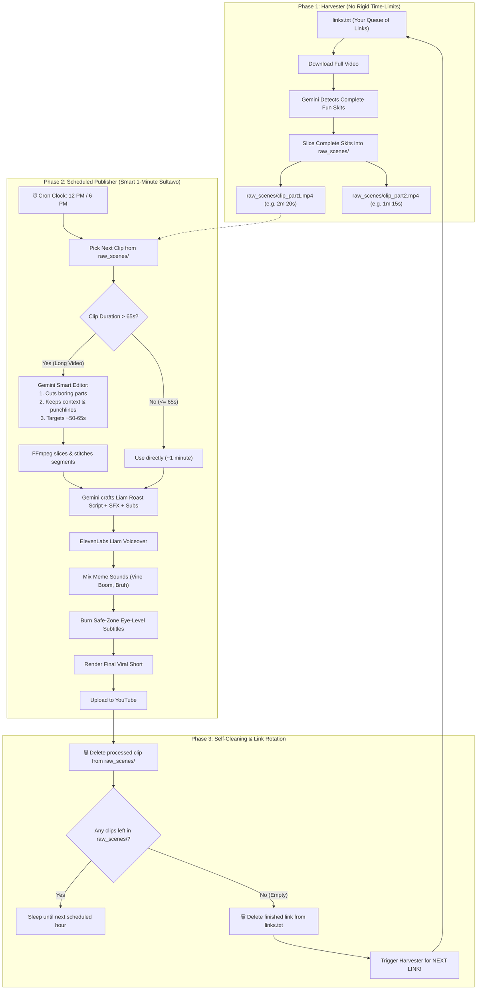

# 🚀 Master Automation Blueprint: 2-Engine Autonomous System
### *Autonomous Chinese Slapstick to Viral UK Meme Shorts Engine*

---

## 📌 1. Core Architecture: Do Azaad Aur Samjhdar Engines

Humara poora system **2 alag-alag aur independent engines** me banta hua hai taaki har step clean, error-free aur 100% autonomous rahe:

```
[links.txt] 
     │
     ▼
┌────────────────────────────────────────────────────────┐
│ 🌾 ENGINE 1: "THE HARVESTER" (Maal Laane Aur Jama Karne Wala) │
│ - Video download karta hai                             │
│ - Gemini poore video se funny skits dhoondhta hai      │
│ - ⚠️ RULE: Clip par koi zabardasti time-limit nahi!    │
│   Poora complete skit (bhale hi 2m 30s ho) save hota   │
│   hai taaki context ya joke ka koi hissa na kate.      │
└────────────────────────────────┬───────────────────────┘
                                 │ Slices complete skits
                                 ▼
                     📁 raw_scenes/ (Tijori / Shelf)
                     ├── clip_1.mp4 (Full Skit - e.g. 2m 20s)
                     ├── clip_2.mp4 (Full Skit - e.g. 1m 40s)
                     └── clip_3.mp4 (Full Skit - e.g. 50s)
                                 │
     ┌───────────────────────────┴───────────────────────┐
     │ ⏰ Scheduled Trigger (Roz 12:00 PM & 6:00 PM IST) │
     ▼                                                   ▼
┌────────────────────────────────────────────────────────┐
│ 🎬 ENGINE 2: "THE SMART PUBLISHER" (Smart Editor & Dubber) │
│ - raw_scenes/ se agla 1 clip uthata hai               │
│ - 🧠 SMART 1-MINUTE EDITING:                           │
│   Agar video lamba hai (> 65s):                        │
│   • Boring areas (slow pause, chalna, filler) hatata hai│
│   • Story context (setup, snitch, plan) bacha kar rakhta│
│   • Punchline aur hilarious reactions ko lock karta hai │
│   • Video ko around 1 Minute (~50-65s) me sulta deta hai│
│ - Liam ki aawaz me roast voiceover likhta aur bolta hai│
│ - Meme sounds (vine_boom, bruh, wheeze) fit karta hai  │
│ - Center safe-zone subtitles burn karta hai            │
│ - YouTube Shorts par upload karta hai                  │
│ - 🗑️ Upload SUCCESS -> Scene DELETE from raw_scenes/   │
└────────────────────────────────┬───────────────────────┘
                                 │
                                 ▼
                    [Kya raw_scenes/ Khaali Ho Gaya?]
                        ├── NAHI: Agle scheduled time ka intezar karo
                        └── HAAN: Purana link links.txt se DELETE karo
                                  aur Harvester naye link se wapas bhar de!
```

---

## 🌾 2. Engine 1: "The Harvester" (Niyam & Karyapranali)

### 🎯 Mission:
`links.txt` se agla link uthana, uski poori comedy ko samajhna aur unhe **complete raw skits** ke roop me `raw_scenes/` folder me jama karna.

### 📜 Rules & Logic:
1. **No Artificial Time Capping:**
   - Harvester ke level par hum video ko jabardasti 30 ya 35 second me nahi kaatenge!
   - Agar video me **ek hi poora 2 minute 30 second ka continuous scene/skit** hai, to wo poora 2m 30s ka scene as a complete story save hoga.
   - Agar video me 2 ya 3 alag-alag pranks/jokes hain, to har prank ko uske natural start aur end ke sath alag clip banakar save karega (e.g. Part 1, Part 2, Part 3).
2. **Context Preservation:**
   - Har scene me uski poori kahani (shuruaat se lekar aakhri punchline tak) safe rahegi.
3. **Master Video Cleanup:**
   - Raw master video download hone ke baad scenes cut hote hi master video turant delete ho jayega taaki disk memory 100% clean rahe.

---

## 🎬 3. Engine 2: "The Smart Publisher" (Intelligent 1-Minute Sultawo Plan)

### 🎯 Mission:
Fixed scheduled time par (e.g. **Roz 12:00 PM aur 6:00 PM IST**) jagna, 1 video uthana, use 1 minute ke viral Short format me dhalna, dub karna, meme SFX lagana aur upload karke clip delete karna.

### 🧠 The "Smart 1-Minute Sultawo" Logic:
Jab Engine 2 `raw_scenes/` se clip uthata hai, tab do situations hoti hain:

#### Case A: Clip Pehle Se Hi Chhoti Hai (<= 65 Seconds):
* Agar clip already ~50s ya 60s ki hai, to isme video trimming ki koi zaroorat nahi hai.
* Gemini sidha full clip ke liye Liam roast script, meme sounds aur subtitles likhta hai.

#### Case B: Clip Lambi Hai (> 65 Seconds, jaise 1m 30s ya 2m 34s):
* Yahan Gemini ek **Super Intelligent Video Editor** ki tarah kaam karta hai:
  1. **Chinese Dialogue & Action Comprehension:** Gemini sunta aur dekhta hai ki asali mein kya chal raha hai (snitch kya bola, biwi kyu aa rahi hai, kya plan bana).
  2. **Boring Areas Removal:**
     - Beech ka dead time, slow chalna, repetitive reactions, ya lamba awkward pause pehchaan kar hata deta hai.
  3. **Crucial Context & Punchline Lock:**
     - Aisa nahi ki shuruaat ka setup hi uda diya! Jo hissa dekh kar audience ko samajh aayega ki "ho kya raha hai", wo setup aur aakhri funny climax dono ko 100% retain karta hai.
  4. **Target 1-Minute Sultawo:**
     - Total edited video ko **around 1 minute (~50s se 65s, ya 60-68s)** ke andar sulta deta hai!
     - Gemini exact time ranges deta hai (e.g. `[[0.0, 20.0], [45.0, 85.0]]` = 60s total).
  5. **FFmpeg Clean Stitching:**
     - FFmpeg un chuninda funny segments ko seamlessly stitch karta hai bina kisi glitch ke.
  6. **Script Synchronized to Stitched Timeline:**
     - Gemini script, Liam voiceover, meme SFX aur subtitles ko us nai 1-minute ki timeline ke hisaab se perfectly sync karta hai!

---

## 🎙️ 4. Dubbing, Sound Design & Visuals (Liam Spec)

1. **Narrator Voice:**
   - **Liam (`TX3LPaxmHKxFdv7VOQHJ`)** via ElevenLabs Multi-Key Rotator (10 accounts = 100,000 characters).
   - High-energy, sarcastic BBC comedy creator tone.
2. **Silence Pockets & Meme Sounds:**
   - Liam ki speech ke beech me 1.0 - 1.5s ka natural gap rehta hai jisme iconic meme sound effects aate hain:
     - `vine_boom.mp3` -> Jab snitch pakadta hai
     - `ding_idea.mp3` -> Jab jugad dimag me aata hai
     - `bruh.mp3` -> Jab biwi samne aati hai
     - `oh_no_wheeze_laugh.mp3` -> Jab ajeebo-garib disguise banta hai
3. **Center-Screen Safe Zone Subtitles:**
   - Yellow/Cyan punchy dynamic text.
   - Position: Eye-Level (`MarginV: 420`) taaki YouTube Shorts ke UI buttons (Like, Share, Sound icon) subtitles ko na chhupayein.

---

## 🔄 5. Self-Cleaning & Auto-Link Rotation (Pura Aaram Mode)

1. **Short Render & Upload:**
   - Final Short banne ke baad YouTube par upload hota hai.
2. **Immediate Scene Cleanup:**
   - Upload successful hote hi wo clip `raw_scenes/` se **DELETE** ho jati hai!
3. **Queue Check:**
   - Engine check karta hai: *Kya `raw_scenes/` me aur clips bachi hain?*
   - **Agar bachi hain:** Agle scheduled upload (e.g. shaam 6 baje) ke liye ready rehta hai.
   - **Agar 0 clips bachi hain (pura video khatam):**
     - Finished link ko `links.txt` se **DELETE** kar deta hai.
     - Turant Harvester ko call karta hai: Harvester agle link se video laakar `raw_scenes/` ko naye funny clips se **REFRESH / RE-FILL** kar deta hai!
     - Aapko baar-baar aakar check karne ki zaroorat nahi — aap aaram karo, rotation chalta rahega!

---

## 📊 6. Complete System Flowchart



---

## 🚀 7. GitHub Actions Deployment Schedule

Workflow file: `.github/workflows/scheduled_shorts_publisher.yml`
* **Cron Schedule:** `30 6,12 * * *` (12:00 PM & 6:00 PM Indian Standard Time)
* **Manual Dispatch:** Kisi bhi samay ek click me chala sakte ho.
* **Autonomous Commits:** Jab bhi clip delete hoti hai ya link rotate hota hai, GitHub Actions changes ko automatically repo me commit aur push kar deta hai taaki state hamesha sync rahe!
