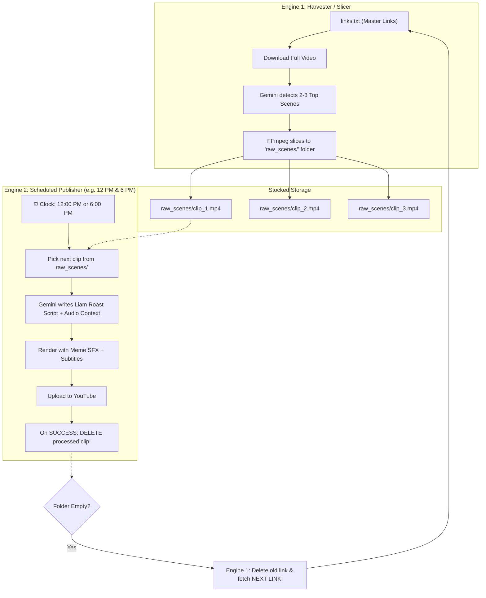

# 🚀 Master Automation Blueprint: Two-Engine Scheduled System

## 📌 Core Architecture: Two Decoupled Engines

Humara poora system **2 alag-alag aur azaad engines (roles)** me divide rahega:

---

### ⚙️ Engine 1: "The Harvester / Slicer" (Maal Laane Aur Katne Wala)
* **Kaam:** Links se video download karke unke funny scenes kaat kar tijori (folder) me jama karna.
* **Flow:**
  1. `links.txt` se agla link uthata hai.
  2. Full video download karta hai.
  3. Gemini 3.5 Flash Lite ko deta hai -> Gemini video dekh-sun kar **2 ya 3 best funny scenes** ke cut points nikaalta hai.
  4. FFmpeg unhe kaat kar `raw_scenes/` folder me jama kar deta hai:
     * `raw_scenes/clip_1.mp4` (~35s)
     * `raw_scenes/clip_2.mp4` (~35s)
     * `raw_scenes/clip_3.mp4` (~35s)
  5. Bada video delete kar deta hai taaki memory khali rahe.

---

### ⏰ Engine 2: "The Timed Publisher" (Ghadi Dekh Kar Upload Karne Wala)
* **Kaam:** Fixed time par (jaise **Roz Din me 2 Baar: 12:00 PM aur 6:00 PM**) jagna aur video upload karna.
* **Flow:**
  1. Theek nirdharit samay par GitHub Actions cron job jagta hai.
  2. `raw_scenes/` folder me se **agla 1 video clip** uthata hai.
  3. Use Gemini ke paas bhejta hai:
     * Gemini Chinese dialogue aur action sun-dekh kar **witty roast script** likhta hai.
     * **Liam** ki aawaz me voiceover banta hai.
     * Funny beats par **meme sounds** (`vine_boom`, `bruh`, `wheeze`) lagti hain.
     * Center eye-level subtitles burn hote hain.
  4. Short ko **YouTube par upload** karta hai.
  5. **Jaise hi upload SUCCESS hua -> Wo video clip folder se DELETE ho jata hai!**

---

### 🔄 In Dono Ka Aapas Me Connection (Auto-Refill & Link Delete):
* Engine 2 roz video banata aur delete karta rahega.
* Jaise hi `raw_scenes/` folder **KHAALI (0 video)** hoga:
  * Engine 1 turant samajh jayega ki pichla link poora khatam ho chuka hai!
  * Wo purane link ko `links.txt` se **DELETE** karega.
  * Agle link ko download karke naye scenes kaat kar folder ko **wapas bhar (re-fill) dega!**
  * Aur Engine 2 bina ruke agle time par fir se naya video upload karega.

---

## 📊 Flow Diagram

